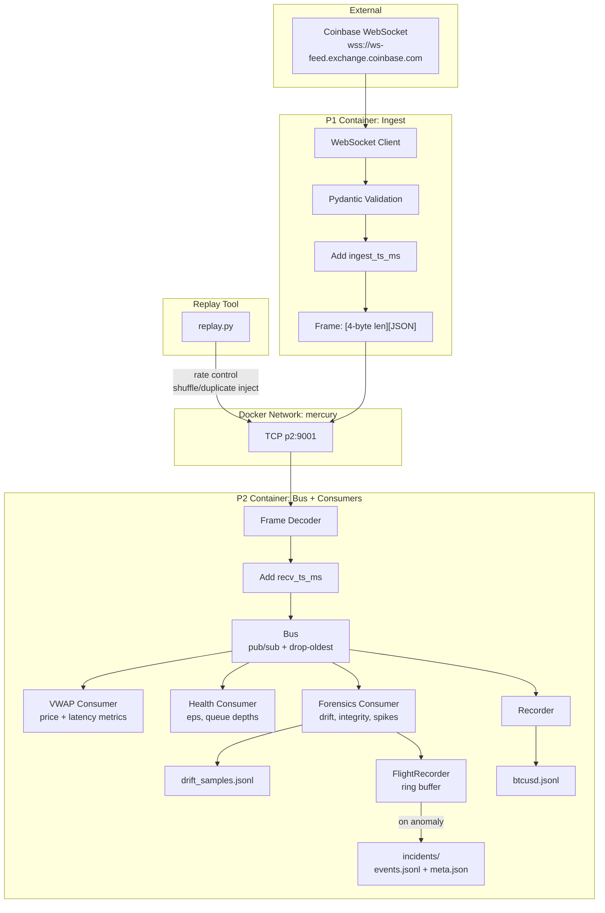

# MercuryStream

A production-grade market data pipeline with real-time anomaly detection and forensic incident capture.

## What This Demonstrates

| Capability | Why It Matters |
|------------|----------------|
| **Backpressure Handling** | When consumers lag, drop-oldest keeps data fresh instead of building unbounded queues |
| **Tail Latency Observability** | p50 lies—we track p50/p95/p99 to expose real performance |
| **Data Quality Detection** | Schema drift, duplicates, out-of-order events caught in real-time |
| **Flight Recorder Pattern** | Auto-captures incident bundles for post-mortem analysis—like an airplane black box |
| **Deterministic Replay** | Reproduce any incident with the exact data that caused it |

## Architecture



## Quick Start

```bash
# Start the pipeline
docker compose up --build

# Watch P2 logs (metrics + forensics)
docker logs -f mercurystream-p2

# In another terminal, watch P1 logs
docker logs -f mercurystream-p1
```

You'll see output like:
```
P2 listening on 0.0.0.0:9001
Forensics consumer enabled
Client connected: ('172.21.0.3', 44316)
VWAP=87348.24 | age p50=0 p95=1 p99=1 | pipe p50=0 p95=0 p99=0 | drops=0
HEALTH | eps=4.2 | price=87348.24 | drops=0 | subs=3 | qdepths=[0, 0, 1]
FORENSICS | processed=100 | drift=0 | dup=0 | ooo=0 | gaps=0 | spikes=0 | incidents=0
```

## Trigger an Incident (Demo)

```bash
# Replay historical data with 10% duplicate injection
python replay.py --file data/btcusd.jsonl --rate 200 --duplicate-rate 0.1

# Watch forensics detect and capture:
# FORENSICS | processed=5000 | drift=0 | dup=450 | ooo=0 | gaps=0 | spikes=0 | incidents=1

# View captured incidents
ls data/incidents/
cat data/incidents/*/meta.json
```

See [DEMO.md](DEMO.md) for the full demo walkthrough.

## Project Structure

```
mercurystream/
├── docker-compose.yml       # Container orchestration
├── replay.py                # Incident replay tool
├── DEMO.md                  # Demo walkthrough
├── SYSTEM.md                # Detailed system documentation
├── data/
│   ├── btcusd.jsonl         # Recorded market data
│   ├── drift_samples.jsonl  # Schema drift samples
│   └── incidents/           # Captured incident bundles
│       └── <timestamp>_<uuid>/
│           ├── events.jsonl
│           └── meta.json
└── services/
    ├── shared/              # Common code
    │   ├── logger.py        # Centralized loguru config
    │   ├── models.py        # Pydantic Ticker model
    │   └── requirements.txt
    ├── p1/                  # Ingest service
    │   ├── Dockerfile
    │   └── p1.py
    └── p2/                  # Bus + consumers
        ├── Dockerfile
        ├── p2.py            # TCP server + Bus
        ├── consumer.py      # VWAP, Health, Slow consumers
        ├── forensics.py     # Anomaly detection + FlightRecorder
        └── recorder.py      # Async JSONL writer
```

## Configuration

All configuration via environment variables:

### P1 (Ingest)
| Variable | Default | Description |
|----------|---------|-------------|
| `SYMBOL` | `BTC-USD` | Coinbase trading pair |
| `P2_HOST` | `p2` | P2 service hostname |
| `P2_PORT` | `9001` | P2 service port |
| `BACKOFF_MAX` | `10.0` | Max reconnect backoff (seconds) |
| `LOG_LEVEL` | `INFO` | Logging verbosity |

### P2 (Bus)
| Variable | Default | Description |
|----------|---------|-------------|
| `HOST` | `0.0.0.0` | Bind address |
| `PORT` | `9001` | Listen port |
| `RECORD` | `false` | Enable JSONL recording |
| `RECORD_FILE` | `data/btcusd.jsonl` | Recording path |
| `ENABLE_SLOW` | `false` | Enable slow consumer (demo) |
| `SLOW_DELAY_MS` | `50` | Slow consumer delay |
| `FORENSICS` | `true` | Enable forensics consumer |

### Forensics
| Variable | Default | Description |
|----------|---------|-------------|
| `LATENCY_SPIKE_THRESHOLD_MS` | `100` | P99 threshold for spike detection |
| `DUPLICATE_LRU_MAX` | `50000` | Trade IDs tracked for dedup |
| `FLIGHT_PRE_EVENTS` | `5000` | Ring buffer size (pre-incident) |
| `FLIGHT_POST_EVENTS` | `2000` | Events captured post-trigger |
| `FLIGHT_COOLDOWN_S` | `60` | Seconds between incidents |

## Key Design Decisions

| Decision | Choice | Rationale |
|----------|--------|-----------|
| **IPC Protocol** | `[4-byte BE len][JSON]` | Simple, language-agnostic, no delimiters |
| **Backpressure** | Drop-oldest | Live data: freshness > completeness |
| **Serialization** | orjson | 10x faster than stdlib json |
| **Validation** | Pydantic v2 | Type safety + excellent errors |
| **Flight Recorder** | Ring buffer + trigger | Captures context *before* you knew there was a problem |
| **Timestamps** | `ingest_ts_ms` + `recv_ts_ms` | Separate exchange→P1 vs P1→P2 latency |

## Replay Tool

```bash
# Basic replay at 500 events/sec
python replay.py --file data/btcusd.jsonl --rate 500

# Inject out-of-order events (shuffle within 10-event windows)
python replay.py --file data/btcusd.jsonl --rate 200 --shuffle-window 10

# Inject 5% duplicates
python replay.py --file data/btcusd.jsonl --rate 200 --duplicate-rate 0.05

# Replay a captured incident
python replay.py --file data/incidents/<id>/events.jsonl --rate 100
```

## What Gets Detected

| Anomaly | Detection Method | Incident Trigger |
|---------|------------------|------------------|
| **Schema Drift** | Missing keys, type mismatches | Logged to drift_samples.jsonl |
| **Duplicates** | LRU set of trade_ids (50k) | Yes |
| **Out-of-Order** | Exchange timestamp comparison | Counted, not triggered |
| **Sequence Gaps** | Sequence number tracking | Yes |
| **Latency Spikes** | Rolling P99 > threshold | Yes (after 2 consecutive) |

## License

MIT
