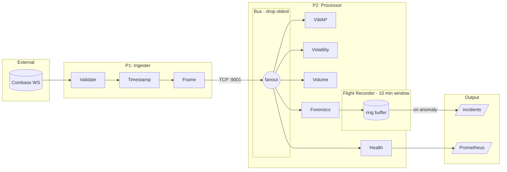

# MercuryStream

**A real-time market data pipeline that solves the problems exchanges warn you about.**

---

## Why I Built This

Three problems kept showing up in financial data engineering that nobody talks about until they bite you:

### 1. Feed Formats Change Without Notice

[Cboe's PITCH specification](https://cdn.cboe.com/resources/membership/US_EQUITIES_OPTIONS_MULTICAST_PITCH_SPECIFICATION.pdf) explicitly states they "reserve the right to add message types and grow the length of any message without notice." Your decoder breaks, your pipeline goes silent, and you find out from angry traders and not from monitoring.

**MercuryStream detects schema drift in real-time** and samples malformed events for debugging without blocking the hot path.

### 2. "Replay Yesterday" Is a Real Requirement

[KX's kdb+tick architecture](https://code.kx.com/q/wp/rt-tick/) uses tickerplant logs specifically designed for replay—recovering state after failures, onboarding new subscribers, reproducing bugs. This isn't optional in production finance.

**MercuryStream captures 10 minutes of rolling context** and dumps incident bundles (5K events before + 3K after) that can be replayed deterministically.

### 3. Consumer Lag Is a Silent Killer

[Confluent's production issues guide](https://www.confluent.io/blog/5-common-pitfalls-when-using-apache-kafka-consumer-groups/) calls out high consumer lag as one of the most common production problems. Slow consumers back up queues, memory explodes, and suddenly you're processing stale prices.

**MercuryStream uses drop-oldest backpressure**—when a consumer falls behind, old events are dropped to keep data fresh. Drops are counted, not hidden.

---

## Performance

| Metric               | Value             | Context                       |
| -------------------- | ----------------- | ----------------------------- |
| **Throughput**       | 57,000 events/sec | Sustained, single connection  |
| **Latency p99**      | <2ms              | End-to-end through pipeline   |
| **Memory**           | <100MB            | Per container, bounded queues |
| **Incident Capture** | 8,000 events      | 5K pre + 3K post anomaly      |

---

## What Gets Caught

| Anomaly            | How                   | Why It Matters              |
| ------------------ | --------------------- | --------------------------- |
| **Schema Drift**   | Key/type validation   | Upstream changed the format |
| **Duplicates**     | LRU trade_id tracking | Exchange retransmit or bug  |
| **Out-of-Order**   | Timestamp comparison  | Network reordering          |
| **Sequence Gaps**  | trade_id continuity   | Missed messages             |
| **Latency Spikes** | Rolling p99 threshold | Downstream slowdown         |

When anomalies are detected, the **Flight Recorder** automatically captures the surrounding context—like an airplane black box, but for your data pipeline.

### Why No Continuous Recording?

Most pipelines record everything to disk "just in case." This creates problems:
- **Storage bloat** — At 50K events/sec, you're writing ~4GB/hour of JSON
- **I/O contention** — Disk writes compete with your hot path
- **Needle in haystack** — When something breaks, you're searching through hours of normal data

MercuryStream takes a different approach: **record nothing until something goes wrong.**

The Flight Recorder maintains a 10-minute rolling window in memory. When an anomaly triggers, it dumps 5,000 events before and 3,000 events after the incident to disk. You get the exact context you need for debugging—nothing more, nothing less.

This means:
- **Zero disk I/O during normal operation**
- **Bounded memory** (~5MB for the ring buffer)
- **Incident files are self-contained** — each one has everything needed to reproduce the problem

---

## Architecture



**IPC Protocol:** `[4-byte BE length][JSON payload]` over TCP. Simple, language-agnostic, no delimiter escaping.

---

## Quick Start

```bash
# Clone and run
git clone https://github.com/yourusername/mercurystream
cd mercurystream

# One command: start services, inject anomalies, capture incidents
make demo
```

**Requirements:** Docker, Docker Compose, Make, Python 3.10+

### What Happens

1. **Services start** — Ingester connects to Coinbase, Processor spins up consumers
2. **Replay injects anomalies** — 5% duplicates, 3% schema drift, shuffled order
3. **Forensics triggers** — Detects anomalies, captures incident bundles
4. **Reports generate** — Markdown analysis with evidence samples

```

→ Starting services...
→ Replaying with anomalies (5% dup, 3% drift, shuffle=10)...
→ Incidents captured: 3
→ Reports generated: data/incidents/*/report.md

FORENSICS | processed=15000 | drift=127 | dup=412 | gaps=0 | incidents=3
```

---

## Observability

| Endpoint        | URL                           | Credentials     |
| --------------- | ----------------------------- | --------------- |
| **Grafana**     | http://localhost:3000         | admin / mercury |
| **Prometheus**  | http://localhost:9091         | —               |
| **Raw Metrics** | http://localhost:9090/metrics | —               |

### Prometheus Metrics

```
mercurystream_events_total              # Events processed
mercurystream_events_per_second         # Current throughput
mercurystream_latency_ms_bucket{le=...} # Latency histogram
mercurystream_anomalies_total{type=...} # By anomaly type
mercurystream_incidents_total           # Captured incidents
mercurystream_drops_total               # Backpressure drops
```

---

## Live Output

```
VWAP       | BTC-USD=98234.56 | ETH-USD=3421.78 | e2e p99=1ms | proc p99=0ms
VOLATILITY | BTC-USD=8.1% | ETH-USD=13.7% | SOL-USD=24.3%
VOLUME     | BTC-USD=$1.2M/min(142tx) | ETH-USD=$89K/min(45tx)
HEALTH     | eps=2847.3 | drops=0 | subs=5 | qdepths=[0,0,1,1,1]
FORENSICS  | processed=50000 | drift=0 | dup=0 | gaps=0 | incidents=0
```

---

## Replay Tool (still in development)

Reproduce any incident or inject chaos for testing:

```bash
# Replay a captured incident
python tools/replay.py --file data/incidents/<id>/events.jsonl --rate 500

# Inject duplicates (test deduplication)
python tools/replay.py --file data/incidents/<id>/events.jsonl --rate 500 --duplicate-rate 0.05

# Shuffle order (test OOO detection)
python tools/replay.py --file data/incidents/<id>/events.jsonl --rate 500 --shuffle-window 10

# Inject schema drift (test validation)
python tools/replay.py --file data/incidents/<id>/events.jsonl --rate 500 --drift-rate 0.03
```

---

## Design Decisions

| Choice                       | Why                                                                                                     |
| ---------------------------- | ------------------------------------------------------------------------------------------------------- |
| **Drop-oldest backpressure** | For live market data, a stale price is worse than a missing price. Freshness > completeness.            |
| **Two timestamps**           | `ingest_ts_ms` (exchange→P1) and `recv_ts_ms` (P1→P2) separate network latency from processing latency. |
| **10-minute rolling window** | Enough context for incident analysis without unbounded memory. Fixed at 5K pre + 3K post events.        |
| **p99 not p50**              | Median latency lies. Tail latency is where problems hide. We track p50/p95/p99.                         |
| **orjson over stdlib**       | 10x faster JSON serialization. At 50K events/sec, this matters.                                         |
| **Length-prefix framing**    | `[4-byte len][payload]` has no escaping edge cases. Works with binary payloads. Language-agnostic.      |

---

## Project Structure

```
mercurystream/
├── services/
│   ├── ingester/           # Processor 1: Coinbase WS → TCP
│   │   └── ingester.py
│   ├── processor/          # Processor 2: Bus + Consumers
│   │   ├── processor.py    # TCP server + event routing
│   │   ├── consumer.py     # VWAP, Volatility, Volume, Health
│   │   ├── forensics.py    # Anomaly detection + FlightRecorder
│   │   └── metrics.py      # Prometheus endpoint
│   └── shared/
│       └── models.py       # Pydantic Ticker model (17 fields) for Coinbase ticker events
├── tools/
│   ├── replay.py           # Deterministic replay + chaos injection
│   └── stress.py           # Load testing (multi-connection)
├── grafana/                # Pre-built dashboards
├── data/
│   └── incidents/          # Captured incident bundles
|   └── replay-incidents/   # Replay incident bundles
├── docker-compose.yml
├── prometheus.yml
└── Makefile                # make demo, make stress, make replay
```

---

## Configuration

### Environment Variables

| Variable                     | Default                   | Description                       |
| ---------------------------- | ------------------------- | --------------------------------- |
| `SYMBOLS`                    | `BTC-USD,ETH-USD,SOL-USD` | Trading pairs to subscribe        |
| `LATENCY_SPIKE_THRESHOLD_MS` | `100`                     | p99 threshold for spike detection |
| `DUPLICATE_LRU_MAX`          | `50000`                   | Trade IDs tracked for dedup       |
| `FLIGHT_COOLDOWN_S`          | `60`                      | Minimum seconds between incidents |

### Fixed Settings

These are intentionally not configurable to ensure consistent incident capture:

- **Rolling window:** 10 minutes of data
- **Pre-incident:** 5,000 events max
- **Post-incident:** 3,000 events

---

## Stress Testing

```bash
# 10 seconds at 5,000 events/sec
make stress

# Maximum throughput (unlimited rate)
make stress-max

# Custom: 30 seconds, 10,000 events/sec, 4 parallel connections
python tools/stress.py --duration 30 --rate 10000 --connections 4
```

---

## Incident Reports

When anomalies are detected, MercuryStream generates forensic reports:

```markdown
# Incident Report: 20251224_173003_9e6e5c01

## Summary

| Field            | Value                          |
| ---------------- | ------------------------------ |
| **Type**         | `duplicate_detected`           |
| **Triggered**    | 2025-12-24 17:30:03 UTC        |
| **Total Events** | 8,000 (5,000 pre + 3,000 post) |

## Evidence Samples

### Duplicate Events (2 samples)

{"trade_id": 926076411, "price": 87641.81, "product_id": "BTC-USD"}
{"trade_id": 926076411, "price": 87641.81, "product_id": "BTC-USD"}

## Reproduce

python tools/replay.py --file data/incidents/20251224_173003_9e6e5c01/events.jsonl
```

---

## Tech Stack

| Component         | Choice               | Why                            |
| ----------------- | -------------------- | ------------------------------ |
| **Language**      | Python 3.12          | asyncio for non-blocking I/O   |
| **Validation**    | Pydantic v2          | Type safety + excellent errors |
| **Serialization** | orjson               | 10x faster than stdlib         |
| **WebSocket**     | websockets           | Reliable, well-maintained      |
| **Monitoring**    | Prometheus + Grafana | Industry standard              |
| **Containers**    | Docker Compose       | Simple orchestration           |

---

## References

These are the real-world problems that motivated this project:

- **Schema Drift:** [Cboe PITCH Specification](https://cdn.cboe.com/resources/membership/US_EQUITIES_OPTIONS_MULTICAST_PITCH_SPECIFICATION.pdf) — "reserve the right to add message types and grow the length of any message without notice"
- **Replay Requirements:** [KX kdb+tick Architecture](https://code.kx.com/q/wp/rt-tick/) — tickerplant logs designed for replay and recovery
- **Consumer Lag:** [Confluent Production Issues](https://www.confluent.io/blog/5-common-pitfalls-when-using-apache-kafka-consumer-groups/) — high consumer lag as a common production problem
- **Time-based Lag:** [WarpStream Engineering](https://www.warpstream.com/blog/the-right-way-to-measure-consumer-lag) — why offset-based lag can be misleading

---

## License

MIT

---

I built this to learn and understand why production systems fail.
I built this to understand how anomalies in production data pipelines can be costly and how detecting them can help mitigate them in the future.
I built this to understand how to build a production-ready data pipeline.
