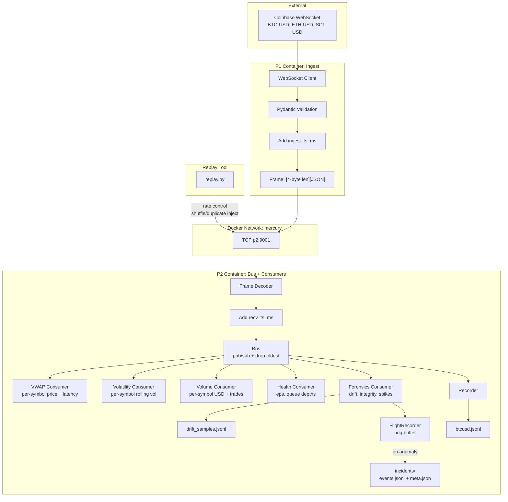

# MercuryStream

A production-grade market data pipeline with real-time anomaly detection and forensic incident capture.

## Performance

| Metric | Value |
|--------|-------|
| **Throughput** | ~57,000 events/sec |
| **Latency p99** | <2ms (P1→P2 pipeline) |
| **Memory** | <100MB per container |

## What This Demonstrates

| Capability | Why It Matters |
|------------|----------------|
| **Backpressure Handling** | When consumers lag, drop-oldest keeps data fresh instead of building unbounded queues |
| **Tail Latency Observability** | p50 lies—we track p50/p95/p99 to expose real performance |
| **Data Quality Detection** | Schema drift, duplicates, out-of-order events caught in real-time |
| **Flight Recorder Pattern** | Auto-captures incident bundles for post-mortem analysis—like an airplane black box |
| **Deterministic Replay** | Reproduce any incident with the exact data that caused it |

## Architecture



## Quick Start

```bash
# One-command demo: start services, inject anomalies, generate reports
make demo

# Or start manually
docker compose up --build
```

### What `make demo` Does

1. Starts all services (P1, P2, Prometheus, Grafana)
2. Injects anomalies (5% duplicates, shuffled order)
3. Triggers incident capture
4. Generates incident reports

```
╔══════════════════════════════════════════════════════════════════╗
║           MercuryStream Incident Detection Demo                  ║
╚══════════════════════════════════════════════════════════════════╝

→ Step 1/5: Starting services...
→ Step 2/5: Verifying services are running...
→ Step 3/5: Injecting anomalies (duplicates + shuffled order)...
→ Step 4/5: Waiting for incident capture to complete...
→ Step 5/5: Generating incident reports...

╔══════════════════════════════════════════════════════════════════╗
║                        Demo Complete!                            ║
╚══════════════════════════════════════════════════════════════════╝
```

### View Incident Report

```bash
cat data/incidents/*/report.md | head -50
```

```markdown
# Incident Report: 20251224_173003_9e6e5c01

## Summary
| Field | Value |
|-------|-------|
| **Type** | `duplicate_detected` |
| **Triggered** | 2025-12-24 17:30:03 UTC |
| **Affected Symbols** | BTC-USD |
| **Total Events** | 2,109 (2,109 pre + 0 post) |

## Evidence Samples
### Duplicate Events
{"trade_id": 926076411, "price": 87641.81, ...}
{"trade_id": 926076411, "price": 87641.81, ...}

## Reproduce
python replay.py --file data/incidents/20251224_173003_9e6e5c01/events.jsonl --rate 500
```

## Observability

| Service | URL | Description |
|---------|-----|-------------|
| **Prometheus** | http://localhost:9091 | Metrics scraping |
| **Grafana** | http://localhost:3000 | Dashboards (admin/mercury) |
| **P2 Metrics** | http://localhost:9090/metrics | Raw Prometheus metrics |

### Metrics Exposed

```
mercurystream_events_total           # Total events processed
mercurystream_events_per_second      # Current throughput
mercurystream_latency_ms_bucket      # Latency histogram
mercurystream_anomalies_total{type}  # Anomalies by type
mercurystream_incidents_total        # Incidents captured
mercurystream_drops_total            # Dropped events
```

See [DEMO.md](DEMO.md) for the full demo walkthrough.

## Project Structure

```
mercurystream/
├── Makefile                 # make demo, make benchmark, etc.
├── docker-compose.yml       # Container orchestration
├── prometheus.yml           # Prometheus scrape config
├── replay.py                # Incident replay tool
├── DEMO.md                  # Demo walkthrough
├── SYSTEM.md                # Detailed system documentation
├── grafana/
│   ├── provisioning/        # Auto-configure datasources
│   └── dashboards/          # Pre-built dashboards
├── data/
│   ├── btcusd.jsonl         # Recorded market data
│   ├── drift_samples.jsonl  # Schema drift samples
│   └── incidents/           # Captured incident bundles
│       └── <timestamp>_<uuid>/
│           ├── events.jsonl
│           ├── meta.json
│           └── report.md    # Generated incident report
└── services/
    ├── shared/              # Common code
    │   ├── logger.py        # Centralized loguru config
    │   ├── models.py        # Pydantic Ticker model
    │   └── requirements.txt
    ├── p1/                  # Ingest service
    │   ├── Dockerfile
    │   └── p1.py
    └── p2/                  # Bus + consumers
        ├── Dockerfile
        ├── p2.py            # TCP server + Bus + metrics
        ├── consumer.py      # VWAP, Health, Slow consumers
        ├── forensics.py     # Anomaly detection + FlightRecorder
        ├── metrics.py       # Prometheus /metrics endpoint
        ├── recorder.py      # Async JSONL writer
        └── incident/        # Report generation
            └── report.py
```

## Configuration

All configuration via environment variables:

### P1 (Ingest)
| Variable | Default | Description |
|----------|---------|-------------|
| `SYMBOLS` | `BTC-USD,ETH-USD,SOL-USD` | Comma-separated Coinbase trading pairs |
| `P2_HOST` | `p2` | P2 service hostname |
| `P2_PORT` | `9001` | P2 service port |
| `BACKOFF_MAX` | `10.0` | Max reconnect backoff (seconds) |
| `LOG_LEVEL` | `INFO` | Logging verbosity |

### P2 (Bus)
| Variable | Default | Description |
|----------|---------|-------------|
| `HOST` | `0.0.0.0` | Bind address |
| `PORT` | `9001` | Listen port |
| `RECORD` | `false` | Enable JSONL recording |
| `RECORD_FILE` | `data/btcusd.jsonl` | Recording path |
| `ENABLE_SLOW` | `false` | Enable slow consumer (demo) |
| `SLOW_DELAY_MS` | `50` | Slow consumer delay |
| `FORENSICS` | `true` | Enable forensics consumer |

### Forensics
| Variable | Default | Description |
|----------|---------|-------------|
| `LATENCY_SPIKE_THRESHOLD_MS` | `100` | P99 threshold for spike detection |
| `DUPLICATE_LRU_MAX` | `50000` | Trade IDs tracked for dedup |
| `FLIGHT_PRE_EVENTS` | `5000` | Ring buffer size (pre-incident) |
| `FLIGHT_POST_EVENTS` | `2000` | Events captured post-trigger |
| `FLIGHT_COOLDOWN_S` | `60` | Seconds between incidents |

## Key Design Decisions

| Decision | Choice | Rationale |
|----------|--------|-----------|
| **IPC Protocol** | `[4-byte BE len][JSON]` | Simple, language-agnostic, no delimiters |
| **Backpressure** | Drop-oldest | Live data: freshness > completeness |
| **Serialization** | orjson | 10x faster than stdlib json |
| **Validation** | Pydantic v2 | Type safety + excellent errors |
| **Flight Recorder** | Ring buffer + trigger | Captures context *before* you knew there was a problem |
| **Timestamps** | `ingest_ts_ms` + `recv_ts_ms` | Separate exchange→P1 vs P1→P2 latency |

## Replay Tool

```bash
# Basic replay at 500 events/sec
python replay.py --file data/btcusd.jsonl --rate 500

# Inject out-of-order events (shuffle within 10-event windows)
python replay.py --file data/btcusd.jsonl --rate 200 --shuffle-window 10

# Inject 5% duplicates
python replay.py --file data/btcusd.jsonl --rate 200 --duplicate-rate 0.05

# Replay a captured incident
python replay.py --file data/incidents/<id>/events.jsonl --rate 100
```

## What Gets Detected

| Anomaly | Detection Method | Incident Trigger |
|---------|------------------|------------------|
| **Schema Drift** | Missing keys, type mismatches | Logged to drift_samples.jsonl |
| **Duplicates** | LRU set of trade_ids (50k) | Yes |
| **Out-of-Order** | Exchange timestamp comparison | Counted, not triggered |
| **Sequence Gaps** | Sequence number tracking | Yes |
| **Latency Spikes** | Rolling P99 > threshold | Yes (after 2 consecutive) |

## Live Consumers

The pipeline runs 5 concurrent consumers processing all symbols:

```
VWAP       | BTC-USD=98234.56 | ETH-USD=3421.78 | SOL-USD=187.23 | age p99=1ms
VOLATILITY | BTC-USD=8.1%     | ETH-USD=13.7%   | SOL-USD=24.3%
VOLUME     | BTC-USD=$1.2M/min(142tx) | ETH-USD=$89.3K/min(45tx) | SOL-USD=$432.1K/min(298tx)
HEALTH     | eps=85.0 | drops=0 | subs=6 | qdepths=[0, 0, 0, 0, 0, 0]
FORENSICS  | processed=10000 | drift=0 | dup=0 | ooo=0 | gaps=0 | spikes=0 | incidents=0
```

| Consumer | What It Does |
|----------|-------------|
| **VWAP** | Per-symbol volume-weighted average price + latency tracking |
| **Volatility** | Per-symbol annualized volatility from rolling log returns |
| **Volume** | Per-symbol USD volume and trade count per minute |
| **Health** | Events/sec, queue depths, drop count |
| **Forensics** | Anomaly detection + incident capture |

## License

MIT
